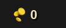
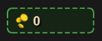
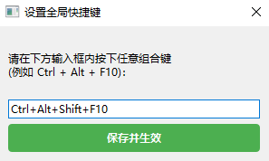
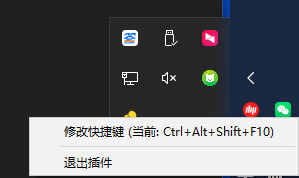

[中文](README.md) | [English](README_EN.md)

# Dota 2 Net Worth Overlay (Real-time)

A lightweight real-time Net Worth overlay for Dota 2 players. It retrieves live game data via the official **Game State Integration (GSI)** and displays the hero's total net worth (gold, item value, Aghanim's Shard, and Scepter bonuses) in a sleek, floating window.

## 📖 Background

In Dota 2, players often need to manually calculate or check the scoreboard to estimate their economic status. To provide better intuition for key item timings and buyback management, this project provides a real-time overlay. It offers data-driven support and automatically toggles visibility based on game state to ensure zero interference with gameplay.

## 📊 Data Sources

1.  **Dota 2 GSI (Game State Integration)**: The core data source. The application automatically configures the GSI interface in your Dota 2 client when launched, and receives JSON packets containing:
    *   `player`: Real-time gold.
    *   `items`: Item names in all slots.
    *   `hero`: Status of Aghanim's Shard and Scepter buffs.
2.  **`item_price.json`**: An internal item price database. The app maps item names from GSI to this JSON to calculate the total value of all equipment.

## 🛠️ Tech Stack & Development

*   **UI Framework**: Built with **C# WPF** for high-performance, transparent, and click-through Windows overlays.
*   **Backend Service**: Uses C# built-in networking libraries to run a local HTTP server (Port 3000) to receive POST data from Dota 2.
*   **State Management**:
    *   **GSI Cache Pool**: Solves the data fluctuation issue caused by GSI's delta updates.
    *   **Multi-threading**: Separates the HTTP server, UI thread, and Dota 2 process monitor.
*   **Interaction**:
    *   Global hotkey (**fixed at `Ctrl+Alt+F10`** to toggle lock/unlock).
    *   Persistent configuration (`config.json`) for window position, lock state, Dota path, and auto-start switch.

## ✨ Features

*   **Real-time Display**: Auto-calculates Gold + Items + Shard/Scepter buffs.
*   **Smart Visibility**: 
    *   Automatically hides when Dota 2 is not running or the player is in the main menu.
    *   Only shows during matches or Demo mode.
*   **Custom Positioning**: Supports dragging when unlocked; supports click-through when locked to avoid interfering with game clicks.
*   **Global Hotkey**: Toggle Lock/Unlock with `Ctrl+Alt+F10` (not customizable in current version).
*   **Auto GSI Configuration**: No manual setup required. GSI configs are automatically deployed upon running.
*   **Configurable Auto-Start**: Enabled by default; disable by setting `AutoStart` to `false` in `config.json`.
*   **Error Logging**: Runtime errors are written to `app.log` (1MB rolling) next to the executable for easy diagnosis.

## 📸 Screenshots

| 1. In-game Default Display | 2. Dragging & Layout |
| :---: | :---: |
|  |  |
| 3. Hotkey Settings | 4. System Tray Management |
|  |  |
| 5. Net Worth Calculation Example | 6. Special Buffs (e.g., Scepter) |
|  |  |

## 🚀 Quick Start

### 1. Run the Plugin
No need to manually configure the Dota 2 GSI; the code configures it automatically.
Simply place the downloaded `exe` file and `item_price.json` in the **same directory** and double-click to run the executable.

### 2. Dota 2 Video Mode
To allow the overlay to appear on top of the game, Dota 2 must be set to **"Borderless Window"** mode.

---

## 🛡️ Security and VAC Policy

Many players are concerned that using such an overlay might lead to a VAC (Valve Anti-Cheat) ban. **Conclusion: This plugin is 100% safe.**

### Why is it safe?

1.  **Official Legal Interface (GSI)**: This plugin is entirely based on Valve's official **Game State Integration** technology. This is a feature provided by Valve for tournament broadcasts, external data statistics, and peripheral synchronization (like Razer/Logitech RGB lighting).
2.  **Non-Invasive**: This plugin **does not read memory** and **does not modify any game files**. It works by receiving JSON data packets sent by the game client itself, acting essentially as an external calculator.
3.  **No Unfair Advantage**: The GSI interface only sends information that you **can already see** in the game (e.g., your own gold and items). It cannot access enemy information hidden in the Fog of War, thus it is not considered cheating.

### Authoritative References
*   [Valve Developer Community: GSI](https://developer.valvesoftware.com/wiki/Counter-Strike:_Global_Offensive_Game_State_Integration) (Dota 2's GSI uses the same architecture)
*   If you check your `Dota 2` configuration folder, you will find that drivers from Logitech, Razer, etc., also generate similar GSI configuration files. This plugin uses the exact same mechanism.

---
*This project is for educational purposes. Please comply with Dota 2's Terms of Service.*
